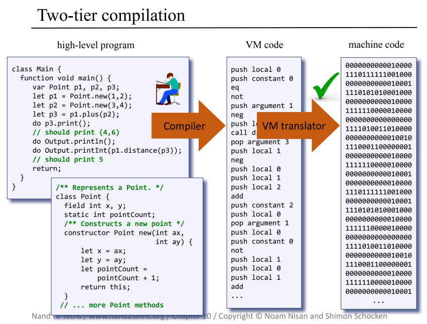

# Jack Compiler  

The Jack Compiler is the front-end of a two-tier compiler for a typical object-based programming language. 

Written in Python 3, the Jack Compiler translates high-level Jack programs into virtual-machine code. The compiler's back end - [the Hack Virtual Machine Translator](https://github.com/ptdriscoll/hack-virtual-machine-translator) - transforms the VM code into native code. Two-tier compilers using virtual machines provide flexibility that makes it easier to run program codes on multiple platforms.

The compiled code is designed to run on a simple general-purpose computer, which is built from scratch in a two-part course called From Nand to Tetris. An accompanying book is called The Elements of Computing Systems: Building a Modern Computer from First Principles. See reference links below. 

 

### Usage

The Jack Compiler reads .jack files and generates .vm files. A path to either a .jack file or a directory with .jack files is fed as a parameter to the command line. A .vm file is created for each .jack file.

The compiler runs the compiler directory as a package from the root folder. To pass a course auto-grader, the program also runs from within the compiler directory, using a file called JackCompiler. Tests run only from the root directory. A file called JackAnalyzer runs just the syntax analyzer, and produces an .xml file for each .jack file.   

Examples from root directory:
- To translate the data/Average/Main.jack file: `python -m compiler data/Average/Main.jack`
- To translate all files in the data/Pong directory: `python -m compiler data/Pong`
- To translate all .jack files and directories in the data directory: `python -m compiler run_all`
- To run a test module, such as test_1_1: `python -m tests.test_1_1`
- To run a specific test, note addition of unittest: `python -m unittest tests.test_1_1.TestTokenizer.test_advance`
- To run all tests: `python -m unittest`

Examples from compiler directory:
- To translate the data/Average/Main.jack file: `python JackCompiler.py ../data/Average/Main.jack`
- To translate all files in the data/Pong directory directory: `python JackCompiler.py ../data/Pong`
- To translate all .jack files and directories in the data directory: `python JackCompiler.py run_all`
- To run the syntax analyzer on the data/Average/Main.jack file: `python JackAnalyzer.py ../data/Average/Main.jack`
- To run the syntax analyzer on all files in the data/Pong directory directory: `python JackAnalyzer.py ../data/Pong`
- To run the syntax analyzer on all .jack files and directories in the data directory: `python JackAnalyzer.py run_all`

### References

- Website: https://www.nand2tetris.org/software
- Book: https://www.amazon.com/Elements-Computing-Systems-Building-Principles/dp/0262640686/ref=ed_oe_p
- Book Chapter 10: http://www.cs.huji.ac.il/course/2002/nand2tet/docs/ch_10_compiler_I.pdf
- Book Chapter 11: http://www.cs.huji.ac.il/course/2002/nand2tet/docs/ch_11_compiler_II.pdf 
- Slides Chapter 10: https://drive.google.com/file/d/1ujgcS7GoI-zu56FxhfkTAvEgZ6JT7Dxl/view
- Slides Chapter 11: https://drive.google.com/file/d/1DfGKr0fuJcCvlIPABNSg7fsLfFFqRLex/view  
- Course I: https://www.coursera.org/learn/build-a-computer
- Course II: https://www.coursera.org/learn/nand2tetris2
- Hack Virtual Machine Translator: https://github.com/ptdriscoll/hack-virtual-machine-translator